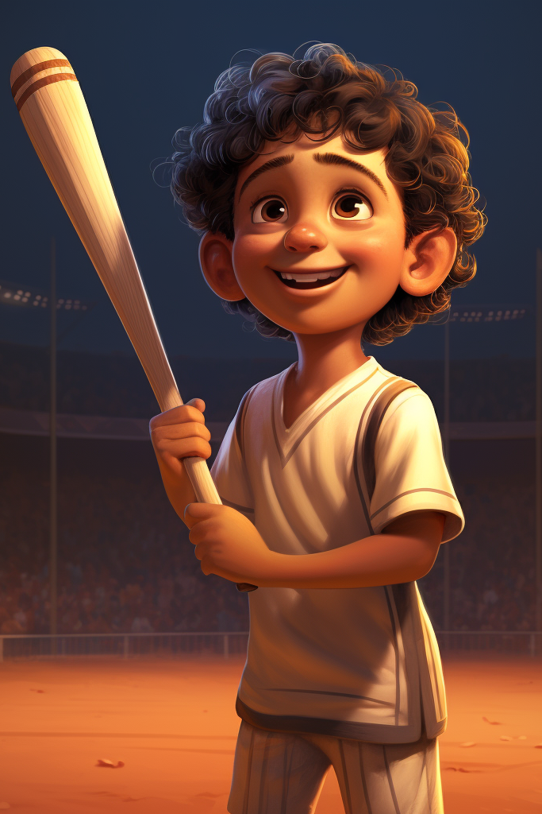
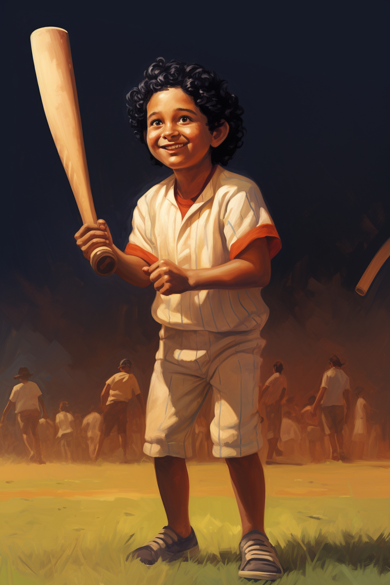
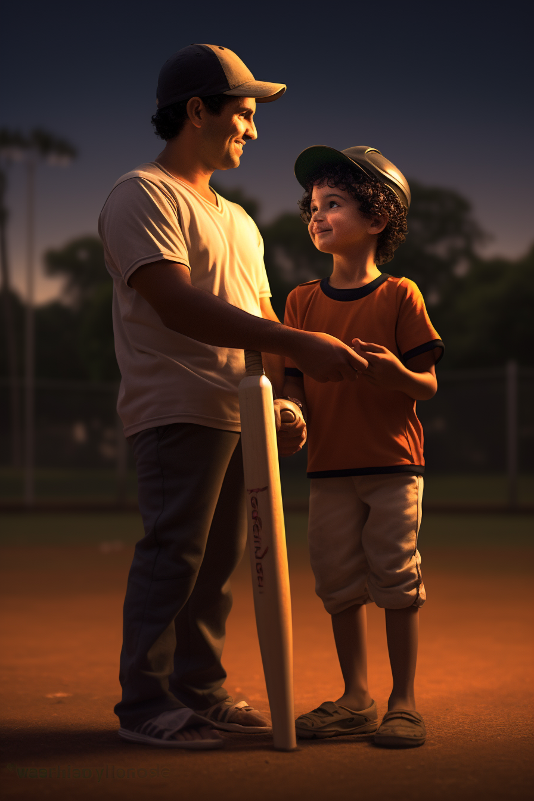
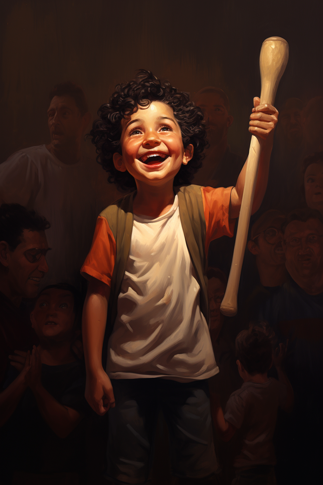
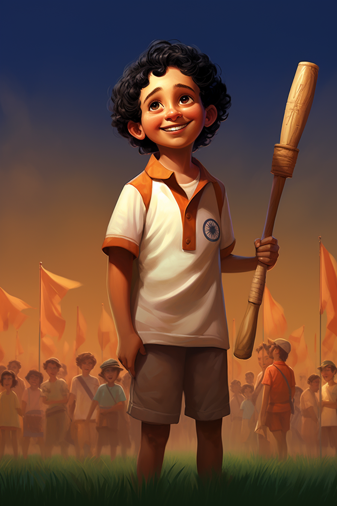
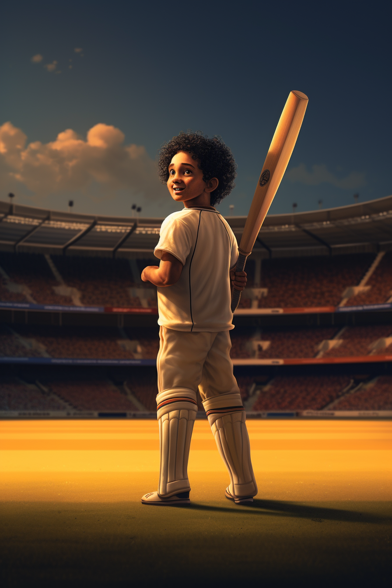
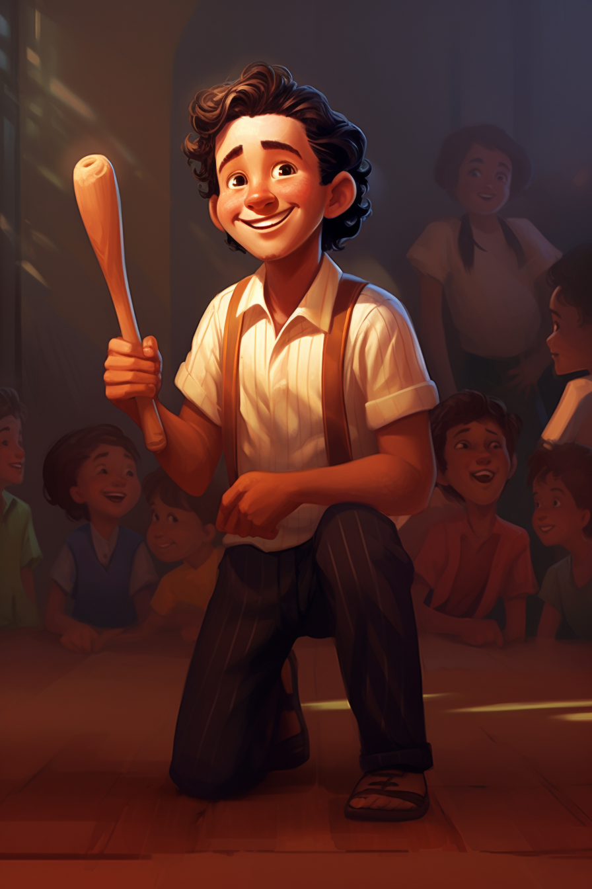
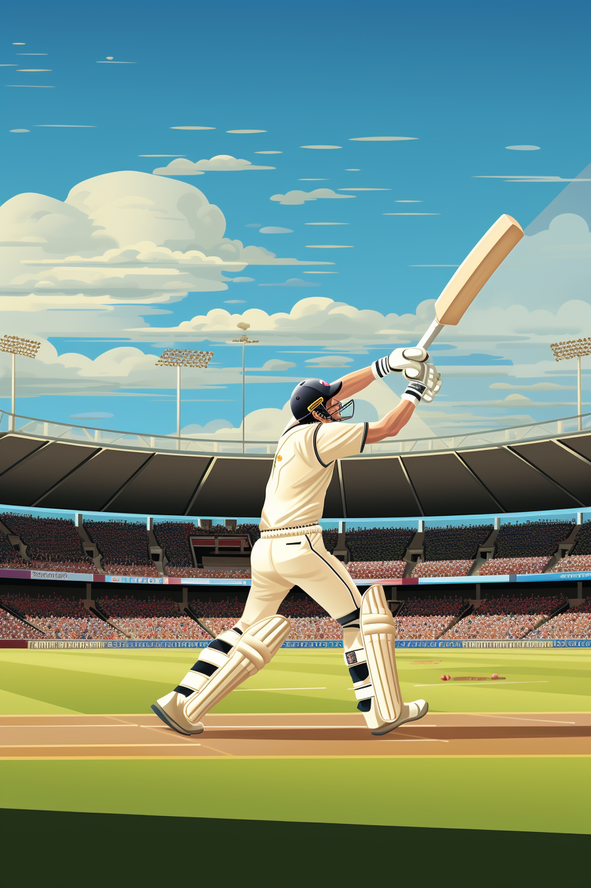

# GraphicNovel - A Boy With Cricket Dream

#### Graphic images generated by: Jinesh Mehta
## Directory structure:
- `ABoyWithCricketDreams/Jinesh/`: Contains concept art images and PDF novel related to the graphic novel "A Boy With Cricket Dreams"  

# Sample Images:

- Page 1: The Dream Begins
  - 
- Page 2: The Magical Cricket Ground
  - 
- Page 3: A Mentor's Wisdom
  - 
- Page 4: Triumphs and Trials
  - 
- Page 5: The Call of the Nation
  - 
- Page 6: The Masterclass
  - 
- Page 7: Humility in Victory
  - 
- Page 8: The Farewell
  - 

## What is the question you are solving?

The question I am solving is how to create a compelling novel based on the popular cricketer Sachin Tendulkar. I want to develop engaging and consistent characters for my story, ensuring that they have depth and resonance with the readers.

## How are you doing it?

I am using a combination of AI tools including ChatGPT, Midjourney, and Canva. First, I utilized ChatGPT to generate initial content and ideas for my novel. Then, I used Midjourney to create a main character by inputting specific traits and characteristics. Once I found a suitable character, I obtained the image ID and seed ID from Midjourney for consistency in generating new images of the character. Canva was used for visual representation and design aspects of the characters and the story.

## What are your results?

I have successfully generated consistent and engaging characters for different phases of the main lead's life. The characters have depth, unique traits, and compelling story arcs, making them relatable to the readers. The visual representation through Canva adds an extra layer of depth to the characters, enhancing the overall storytelling experience.

## How do you know your results are good?

I consider my results good based on the following criteria:

- Consistency: The characters generated using Midjourney consistently align with the initial traits and characteristics I specified, ensuring continuity and coherence in the story.

- Engagement: The characters developed through this process are engaging, with detailed backgrounds and motivations. They evoke emotional responses from the readers, which is a sign of effective character development.

- Visual Appeal: The visual representation of the characters using Canva enhances their appeal. Aesthetically pleasing and visually coherent characters are more likely to capture the readers' attention and imagination.

- Reader Feedback: To further validate the quality of my results, I can gather feedback from beta readers or writing communities. Positive feedback regarding the characters' relatability and depth would indicate the success of my approach.

- Story Flow: As I integrate these characters into my novel, I can assess how smoothly they fit into the storyline. If the characters seamlessly integrate into the plot and contribute meaningfully to the narrative, it indicates the success of the character development process.

By considering these factors, I can confidently assert that my results are good and that the characters I have developed are well-suited for my novel based on Sachin Tendulkar.
